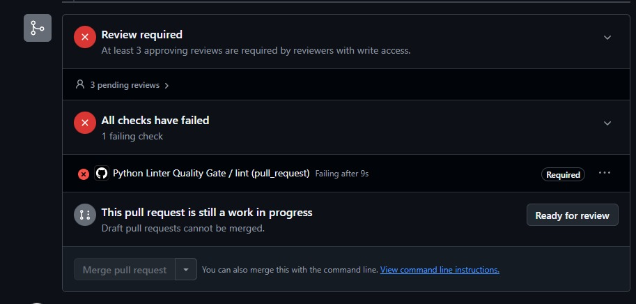
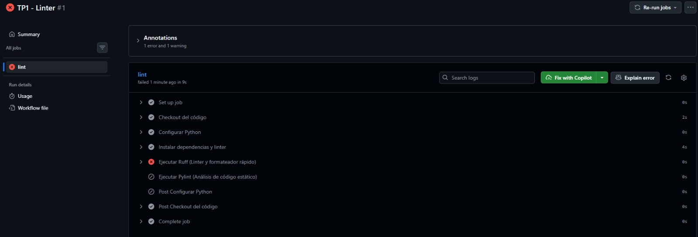

<h1 align="center">🛡️ QA is not here</h1>

<p align="center">
  <b>TP1: Linter — Gate de Calidad con GitHub Actions</b><br>
  Gestión de la Calidad del Software
</p>

<p align="center">
  
  
  
  
  
</p>

---

## 👥 Integrantes

| Integrante | GitHub |
|---|---|
| *(completar)* | |
| *(completar)* | |
| *(completar)* | |
| Maria Pilar Sabena | pilar.sabena |
| *(completar)* | |

---

## 📌 Descripción

Este repositorio implementa un **pipeline de calidad automatizado con GitHub Actions** que funciona
como *gate* obligatorio: si el linteo falla, la Pull Request **no se puede mergear** a `main`.

Como base reutilizamos el código de **SatisPlanning Game**, el proyecto que trabajó uno de nuestros
compañeros en Ingeniería del Software (un juego 2D en Python + Pygame).

> El README original del juego quedó guardado en [`README_OG.md`](README_OG.md).

---

## ⚙️ ¿Cómo funciona?

### Qué dispara el Action

El workflow vive en [`.github/workflows/linter.yml`](.github/workflows/linter.yml) y se llama
**`Python Linter Quality Gate`**. Se ejecuta automáticamente ante:

- `pull_request` dirigido a la rama `main` → corre al abrir la PR **y en cada push nuevo** a esa PR,
  así que nunca se puede colar un commit sin revisar.

No dejamos `push` directo ni `workflow_dispatch`: la única puerta de entrada a `main` es la PR, y esa
puerta la controla el Action.

### Arquitectura del workflow

El job se llama `lint` y corre sobre `ubuntu-latest`:

| # | Paso | Qué hace |
|---|---|---|
| 1 | **Checkout del código** | `actions/checkout@v4` clona el repo en el runner. |
| 2 | **Configurar Python** | `actions/setup-python@v5` instala Python `3.10`, la versión que pide el proyecto en `pyproject.toml`. |
| 3 | **Instalar dependencias y linter** | Actualiza `pip` e instala `ruff` y `pylint`. |
| 4 | **Ejecutar Ruff** | `ruff check .` — linter rápido, barre todo el repo. |
| 5 | **Ejecutar Pylint** | `pylint **/*.py` — análisis estático más profundo. |

```yaml
name: Python Linter Quality Gate

on:
  pull_request:
    branches: [ "main" ]

jobs:
  lint:
    runs-on: ubuntu-latest
    steps:
      - name: Checkout del código
        uses: actions/checkout@v4

      - name: Configurar Python
        uses: actions/setup-python@v5
        with:
          python-version: '3.10'

      - name: Instalar dependencias y linter
        run: |
          python -m pip install --upgrade pip
          pip install ruff pylint

      - name: Ejecutar Ruff (Linter y formateador rápido)
        run: ruff check .

      - name: Ejecutar Pylint (Análisis de código estático)
        run: pylint **/*.py
```

**Por qué dos linters y no uno:** Ruff es muy rápido y ataca sobre todo estilo, imports y errores
obvios, así que sirve como primer filtro barato. Pylint es más lento pero mira la estructura
(complejidad, clases gigantes, atributos de más, código repetido) y encima detecta patrones
propensos a errores en tiempo de ejecución. Uno filtra rápido, el otro filtra hondo.


### Resultado como gate

Si cualquiera de los dos linters devuelve **exit code ≠ 0**, el paso falla → el job `lint` falla →
GitHub marca el check en ❌ → **el botón de merge queda deshabilitado**.

```
push a la PR  ─►  corre el Action  ─►  ¿linters OK?
                                          │
                              sí ─────────┴───────── no
                              │                       │
                        ✅ check verde          ❌ check rojo
                        merge habilitado        merge BLOQUEADO
```

### Qué valida

El linteo analiza el código buscando:

- **Estilo y formato:** indentación, convenciones de nombres, imports sin usar, líneas demasiado
  largas, espacios de más.
- **Calidad estructural:** complejidad ciclomática alta, código duplicado, funciones y clases
  demasiado largas, demasiados argumentos o atributos.
- **Documentación:** módulos, clases y funciones sin docstring (Pylint lo reporta como `C0114`,
  `C0115` y `C0116`).
- **Posibles bugs / code smells:** variables usadas antes de asignarse, atributos que no existen,
  `except` demasiado amplios, recursos que quedan abiertos.

### 🔒 Protección de rama

Sobre `main` configuramos, desde **Settings → Branches → Branch protection rules**:

- ❌ **Push directo prohibido** — todo cambio entra sí o sí por Pull Request.
- ✅ **Status check obligatorio:** `Python Linter Quality Gate / lint (pull_request)` marcado como
  **Required**. Sin ese check en verde, no hay merge.
- 👀 **Review required:** al menos **3 aprobaciones** de revisores con permiso de escritura.

O sea que el gate es doble: lo automático (el linter) y lo humano (las reviews).

---

## 📸 Evidencia

### 1. PR bloqueada: check en rojo y merge deshabilitado



Acá se ve el gate funcionando tal cual lo esperábamos:

- 🔴 **All checks have failed — 1 failing check**
- 🔴 `Python Linter Quality Gate / lint (pull_request)` — *Failing after 9s*, con la etiqueta
  **Required** al costado
- 🔴 **Review required** — *At least 3 approving reviews are required*, con 3 pendientes
- ⬜ El botón **Merge pull request** aparece **gris, deshabilitado**


### 2. Detalle del run en Actions



En el run **`TP1 - Linter #1`** se ve el desglose paso por paso del job `lint`:

| Paso | Estado |
|---|---|
| Set up job | ✅ |
| Checkout del código | ✅ (2s) |
| Configurar Python | ✅ |
| Instalar dependencias y linter | ✅ (4s) |
| **Ejecutar Ruff (Linter y formateador rápido)** | ❌ **falla acá** |
| Ejecutar Pylint (Análisis de código estático) | ⊘ skipped |
| Post Configurar Python / Post Checkout / Complete job | ✅ |

Arriba aparece **Annotations: 1 error and 1 warning**, que es donde GitHub muestra los hallazgos del
linter enganchados a la línea exacta del archivo. El job entero terminó en **failed, en 9s**.

Vale la pena notar que **Pylint quedó como *skipped***: como Ruff ya cortó con exit code ≠ 0, Actions
no sigue ejecutando los pasos siguientes del job. Falla rápido y avisa rápido, que es justo lo que
uno quiere de un gate.

---

## 🎯 Área de calidad — ISO/IEC 25010

Este TP trabaja principalmente sobre la característica de **Mantenibilidad** del modelo de calidad de
producto de software definido en **ISO/IEC 25010** (parte del proyecto **ISO 25000 – SQuaRE**), en
estas subcaracterísticas:

| Subcaracterística | Cómo la atacamos |
|---|---|
| **Analizabilidad** | El linteo automático marca al toque qué archivos y qué líneas tienen problemas de estilo o estructura, sin tener que leer todo el código a mano. Las *annotations* de GitHub te llevan directo a la línea. |
| **Modificabilidad** | Al forzar un estilo consistente y sin code smells, baja el riesgo de romper algo sin querer al tocar el código. Todos escriben parecido, así que cualquiera puede meter mano en un módulo que no escribió. |
| **Facilidad de prueba** | Código más simple, con funciones cortas y menor complejidad ciclomática, necesita menos casos de test para quedar cubierto. |

Y como **Pylint** no se queda solo en el estilo, sumamos también:

| Característica | Subcaracterística | Cómo la atacamos |
|---|---|---|
| **Fiabilidad** | **Madurez** | Pylint detecta patrones propensos a errores en tiempo de ejecución (variables sin definir, atributos inexistentes, recursos que no se cierran, `except` que se tragan cualquier cosa), ayudando a prevenir fallos antes de que lleguen a producción. |

Lo importante del enfoque es que usar el linter como *quality gate* dentro del pipeline de CI hace
que estos atributos se verifiquen **siempre igual, de forma objetiva y en cada cambio propuesto**, en
lugar de depender de que alguien se acuerde de revisarlo a mano durante la review.

---

## 🗂️ Estructura relevante del repo

```
Calidad_software/
├─ .github/
│  └─ workflows/
│     └─ linter.yml        ← el workflow del quality gate
├─ assets/                 ← capturas de evidencia del TP
│  ├─ error1.jpeg
│  └─ error2.jpeg
├─ src/
│  └─ SatisPlanning/       ← código fuente que se lintea
├─ tests/
├─ pyproject.toml
├─ README.md               ← este documento
└─ README_OG.md            ← README original del juego
```

---

## 🔁 Cómo reproducirlo localmente

Antes de subir un cambio conviene correr los mismos linters que corre el CI, así no gastás una vuelta
de Action para enterarte de un espacio de más:

```bash
pip install ruff pylint

ruff check .
pylint src/
```

Si esos dos comandos pasan en local, el check de la PR debería salir verde.

---

